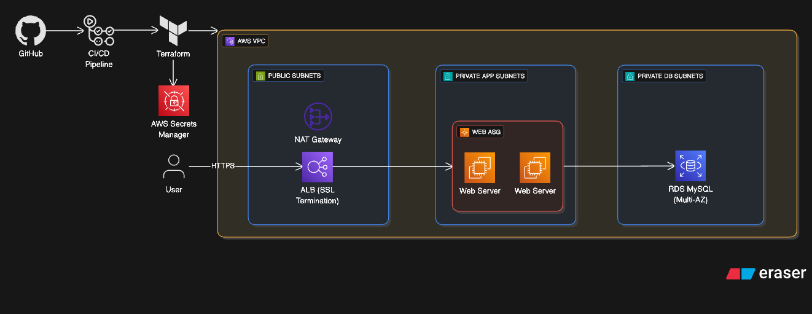

# AWS Three-Tier Architecture with Terraform and CI/CD

This project deploys a complete, production-ready three-tier web application architecture in AWS using Terraform with GitOps-ready CI/CD workflows.

## 🏗️ Architecture Overview

This project creates a comprehensive three-tier architecture with a working web application:



### **Tier 1: Web/Presentation Layer**
- **Application Load Balancer (ALB)** with SSL termination
- **Auto Scaling Group** with EC2 instances in private subnets
- **HTTPS/SSL** encryption with ACM certificates

### **Tier 2: Application Layer** 
- **EC2 instances** running PHP web application
- **Auto Scaling** with configurable min/max capacity
- **Security Groups** allowing only necessary traffic
- **Sample web application** that connects to the database

### **Tier 3: Database Layer**
- **RDS MySQL** database with Multi-AZ support
- **Database subnet group** in private subnets
- **Automated database initialization** with sample data
- **Encrypted storage** for security
- **AWS Secrets Manager** integration for secure password management

## 🚀 Features

### **Infrastructure**
- **Complete three-tier architecture** with web, app, and database layers
- **High availability** across multiple Availability Zones
- **Auto Scaling** for dynamic capacity management
- **Load balancing** with health checks
- **Secure networking** with proper security group rules
- **Encrypted storage** and secure communications

### **Web Application**
- **One-click deployment** - no manual configuration needed
- **SSL certificate support** for HTTPS encryption
- **Database connectivity** with sample data display
- **Beautiful web interface** showing architecture status
- **Real-time monitoring** of all tiers

### **DevOps & Automation**
- **Professional CI/CD pipeline** with GitHub Actions
- **Multi-environment support** (dev, staging, prod)
- **Automated testing** with terraform plan on PRs
- **Environment-specific deployments**
- **Manual destroy workflows** for cost management
- **Comprehensive deployment summaries**

## 📁 Project Structure

```
aws-three-tier-terraform-cicd/
├── .github/workflows/
│   └── terraform.yaml         # CI/CD workflow
├── docs/
│   └── MANUAL_WORKFLOWS.md    # Manual workflow documentation
├── infra/envs/
│   ├── dev/                   # Development environment config
│   ├── staging/               # Staging environment config
│   ├── prod/                  # Production environment config
│   ├── main.tf                # Main infrastructure configuration
│   ├── variables.tf           # Input variables
│   ├── locals.tf              # Local values
│   └── versions.tf            # Terraform and provider versions
├── modules/
│   ├── application/           # Application tier module
│   │   ├── main.tf            # Application module implementation
│   │   ├── variables.tf       # Application module variables
│   │   └── outputs.tf         # Application module outputs
│   └── network/               # Network tier module
│       ├── main.tf            # Network module implementation
│       ├── variables.tf       # Network module variables
│       └── outputs.tf         # Network module outputs
└── scripts/                   # Helper scripts
```

## 🛠️ Prerequisites

- AWS CLI configured with appropriate permissions
- Terraform >= 1.8.0
- GitHub repository with required secrets and variables

## 🔧 Configuration

### OIDC Authentication

This repository is configured to use **OpenID Connect (OIDC)** for AWS authentication instead of access/secret keys. This provides enhanced security by using temporary credentials and eliminating the need to store long-term AWS credentials in GitHub secrets.

For detailed instructions on setting up OIDC authentication and configuring the Terraform backend, see: [one-click-aws-terraform-backend-gitops-oidc](https://github.com/rnato35/one-click-aws-terraform-backend-gitops-oidc)

### Required GitHub Secrets

```
DB_PASSWORD           # RDS database master password (e.g., "YourSecurePassword123!")
```

### Required GitHub Variables

```
AWS_REGION            # AWS region (e.g., us-west-2)
```

### Terraform Variables

Copy `terraform.tfvars.example` to `infra/envs/{environment}/terraform.tfvars` and customize:

```bash
# Example for dev environment
cp terraform.tfvars.example infra/envs/dev/terraform.tfvars
```

**Required Configuration:**

```hcl
# Basic Configuration
region = "us-west-2"
env_name = "dev"
project_prefix = "three-tier"
aws_profile = "your-aws-profile"

# Network Configuration  
vpc_cidr = "10.0.0.0/16"
az_count = 2

# Application Configuration (REQUIRED)
certificate_arn = "arn:aws:acm:us-west-2:123456789012:certificate/your-certificate-id"
domain_name     = "yourdomain.com"  # Used for ALB listener, NOT for DNS creation
subdomain       = "demo"            # Creates subdomain.yourdomain.com

# Database Configuration (password securely managed via GitHub Secrets)
# Note: db_password is not specified here - it's provided via GitHub Secrets → AWS Secrets Manager

# Web Tier Scaling
web_min_capacity     = 1
web_max_capacity     = 3
web_desired_capacity = 2
```

### DNS Configuration (External)

⚠️ **Important**: This project does **NOT** create DNS records. You must manually configure your DNS provider to point your domain/subdomain to the ALB DNS name:

1. Deploy the infrastructure with Terraform
2. Get the ALB DNS name from terraform outputs: `terraform output load_balancer_dns_name`  
3. Create a CNAME record in your DNS provider: `demo.yourdomain.com` → `your-alb-dns-name.us-west-2.elb.amazonaws.com`

## 🚀 Deployment

### GitOps Workflow

1. **Fork or clone** this repository
2. **Configure** the required secrets and variables in your GitHub repository
3. **Create a feature branch** and make your changes
4. **Open a pull request to environment branches** - this triggers:
   - **PR to `env/dev`**: Terraform format check, validation, and plan
   - **PR to `env/staging`**: Terraform format check, validation, and plan
   - **PR to `env/prod`**: Terraform format check, validation, and plan
5. **Environment Deployment Workflow**:
   - **Merge to `env/dev`** - triggers development deployment
   - **Merge to `env/staging`** - triggers staging deployment
   - **Merge to `env/prod`** - triggers production deployment (with manual approval)


### Password Security

The database password is handled securely through multiple layers:

1. **GitHub Secrets**: Store the password in your repository's `DB_PASSWORD` secret
2. **CI/CD Pipeline**: Automatically passes the secret as `TF_VAR_db_password` environment variable
3. **AWS Secrets Manager**: Terraform automatically creates a secret in AWS Secrets Manager with a random suffix
4. **Application Access**: EC2 instances retrieve the password from Secrets Manager using IAM roles
5. **No Hardcoding**: Passwords are never stored in code, configuration files, or Terraform state

## 📊 Outputs

The deployment provides the following outputs:

### **Network Outputs**
- `vpc_id` - VPC ID
- `public_subnet_ids` - List of public subnet IDs
- `private_app_subnet_ids` - List of private app subnet IDs
- `private_db_subnet_ids` - List of private DB subnet IDs

### **Application Outputs**
- `application_url` - HTTPS URL of the application (requires DNS setup)
- `load_balancer_dns_name` - ALB DNS name (use this for DNS provider CNAME)
- `auto_scaling_group_name` - Auto Scaling Group name
- `database_endpoint` - RDS endpoint (sensitive)

## 🗑️ Cleanup

### GitOps Destroy Workflow

Use the **manual workflow** in GitHub Actions to safely destroy infrastructure:

1. **Go to Actions tab** in your GitHub repository
2. **Select "terraform" workflow**
3. **Click "Run workflow"** and configure:
   - **Action**: Select `destroy`
   - **Environment**: Choose `dev`, `staging`, or `prod`
   - **Confirm**: Type `DESTROY` to confirm (required for destroy action)
4. **Manual approval required** for staging and production environments
5. **Infrastructure destroyed** after approval


## 📝 Best Practices

- **Environment separation**: Use different `terraform.tfvars` files for different environments
- **State management**: Configure remote state storage (S3 + DynamoDB) for production
- **Security**: Enable VPC Flow Logs and Network ACLs in production environments
- **Cost optimization**: Consider using a single NAT Gateway for non-production environments

## 🔐 Security Considerations

- Private subnets have no direct internet access
- NAT Gateway provides controlled internet access for private resources
- Network ACLs can be enabled for additional network-level security
- VPC Flow Logs can be enabled for network monitoring

## 🤝 Contributing

1. Fork the repository
2. Create a feature branch
3. Make your changes
4. Test thoroughly
5. Submit a pull request

## 📄 License

This project is open source and available under the MIT License.